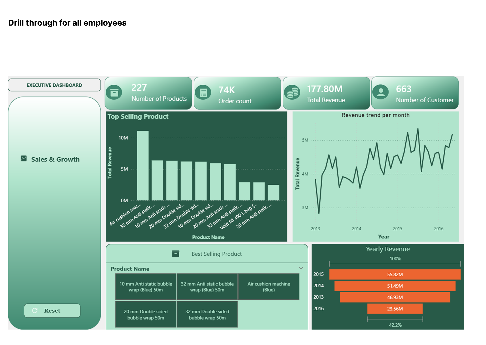

## Sales Insight Dashboard – Wide World Importers

## Overview

This project analyses sales data from the Wide World Importers database using Power BI and SQL Server to deliver interactive reports that reveal customer behaviour, product performance, and overall sales trends.

The dashboard provides business users with a centralized reporting solution for monitoring sales activities and identifying opportunities for business growth.

---

## Business Problem

Retail businesses generate massive amounts of sales data that can be difficult to analyse using traditional reporting methods.

This dashboard simplifies sales analysis through dynamic visualizations that help stakeholders monitor business performance and make informed decisions.

---

## Objectives

- Analyse customer purchasing behaviour
- Monitor sales trends
- Compare product performance
- Evaluate business growth
- Improve executive reporting

---

## Dashboard Features

- Sales Trends
- Customer Analysis
- Product Performance
- Revenue Analysis
- KPI Monitoring
- Interactive Filtering

---

## Business Value

The dashboard provides valuable insights into customer behaviour and product performance, helping organizations improve sales strategies and business planning.

---

## Technologies Used

- Microsoft Power BI
- SQL Server
- Power Query

---

## Skills Demonstrated

- SQL Querying
- Data Modelling
- Business Intelligence
- Dashboard Development
- Data Visualization
- Power BI Reporting

---

## Dashboard Preview

---

## Key Takeaways

This project highlights my ability to integrate SQL Server with Power BI to produce interactive dashboards that support operational and strategic decision-making.
